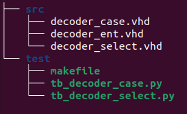

# VHDL #
IN3160/IN4160 
Version 2025-1
(ripped from [in3160/assignments](https://github.uio.no/in3160/assignments))

The goal of this exercise is to to get started designing using VHDL, and creating your first testbench. 

 With GHDL/Cocotb it is not a clear cut method to explicitly specify which architecture of the entity you want to use. 
It is possible to compile each file individually, where the last compiled version of an architecture or entity overrides the previous. 

With Questa the compile order would take of this but it is not the case with GHDL/Cocotb. 
The following is a suggested workaround that only compile the files needed for your chosen architecture. 
This is mosly relevant for task b.
The makefile may be modified like the following:

```make
SIM ?= ghdl 
TOPLEVEL_LANG ?= vhdl 
 
# VHDL 2008 
EXTRA_ARGS +=--std=08 
 
# TOPLEVEL is the name of the toplevel module in your VHDL file 
TOPLEVEL ?= decoder
ARCHITECTURE ?= case
 
VHDL_SOURCES += $(PWD)/../src/$(TOPLEVEL)_ent.vhd 
VHDL_SOURCES += $(PWD)/../src/$(TOPLEVEL)_$(ARCHITECTURE).vhd 
 
SIM_ARGS +=--wave=$(TOPLEVEL).ghw 
 
# MODULE is the basename of the Python test file 
MODULE = tb_$(TOPLEVEL)_$(ARCHITECTURE)
 
# include cocotb's make rules to take care of the simulator setup 
include $(shell cocotb-config --makefiles)/Makefile.sim 
 
# removing generated binary of top entity and .o-file on make clean 
clean:: 
	-@rm -f $(TOPLEVEL) 
	-@rm -f e~$(TOPLEVEL).o 
```
>[!IMPORTANT]
> Note that this is only a template and the makefile you use might have to be altered to fit your setup.  
> This template assumes a strict naming structure:

|  |
| :---: |
| <sup>Structure</sup>| 
 
> decoder_ent.vhd only contains the entity declaration, no architecture.
>
> decoder _case only contains the architecture declaration for the architecture using case (task a)
>
> decoder _select only contains the architecture declaration for the architecture using select (task b)
> Beware that you will need to make clean in between simulations of the different architectures:	

``` 
make ARCHITECTURE=case
make clean
make ARCHITECTURE=select
```


## a) ##
In this exercise, you will design a 2-to-4 bit decoder. Use a case statement in a process to achieve this. The outputs on the decoder should be active low, see truth table below. The decoder shall be implemented on the test board. Use SW1 and SW2 as input, and LD1, LD2, LD3 and LD4 as output.
Test all the possible options for the switches in the simulator (GHDL). Create a python testbench and a makefile that runs the simulation and displays the waveform.

| SW2	| SW1	| LD4 |	LD3	| LD2	| LD1 |
| :---: | :---: | :---: | :---: | :---: | :---: | 
| 0	| 0	| 1	| 1	| 1	| 0 | 
| 0	| 1	| 1	| 1	| 0	| 1 |
| 1	| 0	| 1	| 0	| 1	| 1 |
| 1	| 1	| 0	| 1	| 1	| 1 |

> [!IMPORTANT]
> Approval:
> VHDL design file, makefile for compilation and simulation, waveform file for architecture using case (E.g. .ghw) , constraints file (.XDC)
> 
> The exercise must be demonstrated to the laboratory supervisor for approval 
> (A video demonstrating that you program the board using your own design files may also be used when permitted by the lab supervisor). 

## b) ## 
Create separate files for the entity and architecture. 
Create another architecture that implements the decoder in a concurrent statement using the select statement. 
Make exactly one deliberate change in the LED output, and make a comment for it in the VHDL architecture. 
Compile the newest files and display the new waveform.

> [!IMPORTANT]
> Approval:
> VHDL design files, makefile, waveform file for architecture using select (E.g .ghw)

